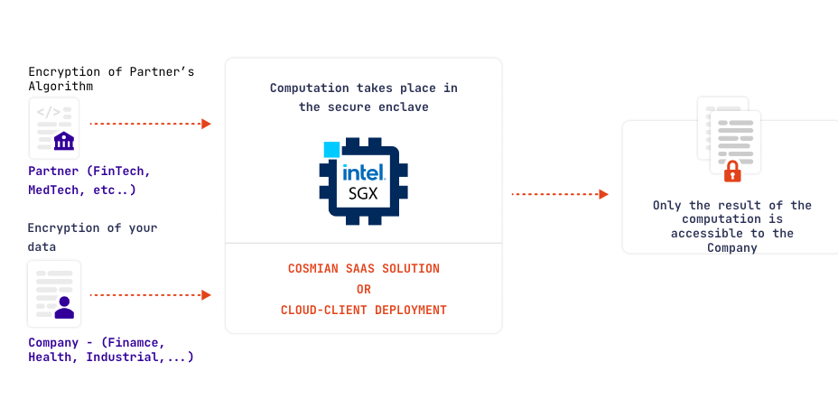
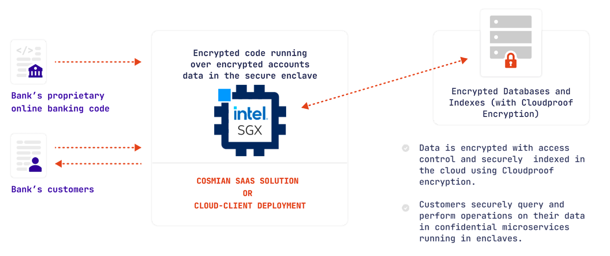

MSE enables two security scenarios.
The scenario is selected through the settings of the app configuration file.

!!! info "Info" 

    In the case of the SaaS MSE offering, Cosmian is the operator and the cloud provider is Azure or OVH.

## Zero trust: collaborative confidential computation (CCC)

In this scenario, no participant trusts any other participant.

|                      | Cloud provider | Operator | App owner | A third party |
| :------------------: | :------------: | :------: | :-------: | :-----------: |
| The app owner trusts |    ✖️  (no)     |    ✖️     |    NA     |       ✖️       |
| The app user trusts  |       ✖️        |    ✖️     |     ✖️     |       ✖️       |

A real-world example is the collaboration between an algorithm provider (typically an AI/ML company: Medtech, Biotech, Fintech,...) and a data provider (hospital, bank, industrial,...).

The Algorithm Provider (_app owner_) wishes to offer the prediction/analysis capabilities of its algorithms but wants to protect its intellectual property.

The Data Provider (_app user_) wishes to operate the algorithms on its data but wants to keep them private from everyone (algorithm provider, operator, cloud provider, and another potential data provider).

!!! info "Info"

    This scenario is the **default mode** of the `deploy` subcommand.

## App owner trusted: fully encrypted SaaS

In this scenario, the app user trusts the app owner.

|                      | Cloud provider | Operator | App owner | A third party |
| :------------------: | :------------: | :------: | :-------: | :-----------: |
| The app owner trusts |       ✖️        |    ✖️     |    NA     |       ✖️       |
| The app user trusts  |       ✖️        |    ✖️     |     ✔️     |       ✖️       |

A real-world example is a bank wishing to move to the cloud and securely operate its online
banking application in the cloud:

The bank (_app owner_) wishes to keep its code private from the operator and from the cloud provider.

The bank's customer (_app user_) trusts the bank: the bank already has its data in clear text.
However, the customer and the bank wish to keep the data private from the operator and the cloud provider.

!!! info "Info"

    The app owner has to provide an SSL certificate when deploying its application, using the `ssl` paragraph in the config file.

## Deploying using `--untrusted-ssl`

In that case, the app user trusts everyone.

|                      | Cloud provider | Operator | App owner | A third party |
| :------------------: | :------------: | :------: | :-------: | :-----------: |
| The app owner trusts |       ✖️        |    ✖️     |    NA     |       ✖️       |
| The app user trusts  |       ✔️        |    ✔️     |     ✔️     |       ✖️       |

This scenario is interesting for developers wishing to quickly test their applications, using test data, without being bothered by any certificate generation or DNS configuration.

## MSE security features

An MSE node is built on top of an Intel SGX enclave.
SGX enables running an app in a fully isolated environment, where the filesystem and the memory are fully encrypted, using a hidden secret engraved in the CPU.
MSE implements the following additional security features:

|                        Feature                        | Zero trust CCC | Fully encrypted SaaS | `--untrusted-ssl` mode |
| :---------------------------------------------------: | :------------: | :------------------: | :--------------------: |
|    Code encryption when deploying to the MSE node     |       ✔️        |          ✔️           |           ✔️            |
| Code & Data encrypted while running (on disk/on ram)  |       ✔️        |          ✔️           |           ✔️            |
| App owner can verify the MSE instance when deploying  |       ✔️        |          ✔️           |           ✔️            |
| User can verify the MSE instance before using the app |       ✔️        |          ✖️           |           ✖️            |
|        Full protection of User queries & data         |       ✔️        |  ✔️ (but App Owner)   |    ✔️ (but Operator)    |
|      App is directly callable from a web browser      |       ✖️        |          ✔️           |           ✔️            |

Verification of the MSE instance mainly consists in:

- verifying that the environment uses an actual SGX enclave (and not some simulator) through a process called remote attestation
- verifying that the correct code, and other components of the software stack, are running inside the enclave
