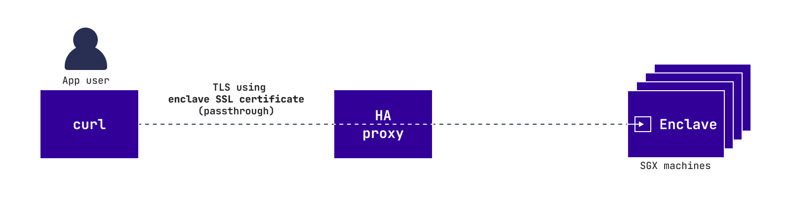
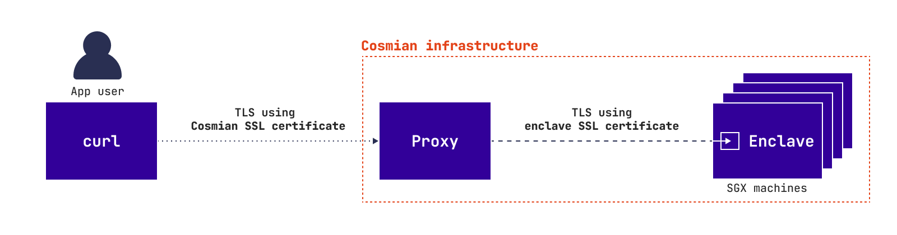
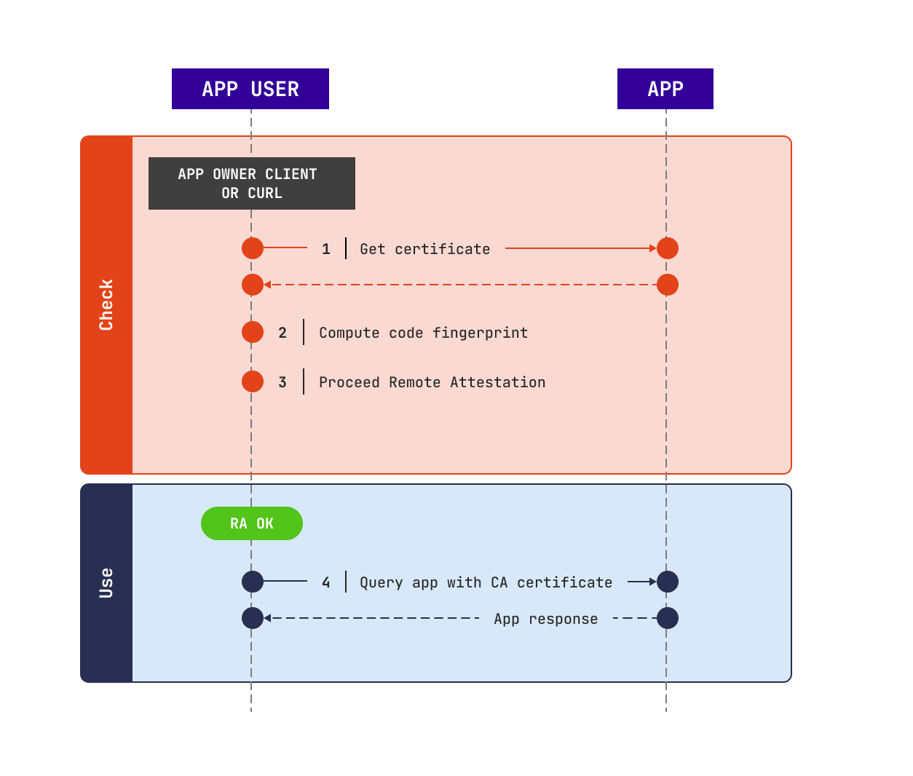

## Overview

The application has been developped by the app owner. Therefore, how to use it depends on its own API.

However, there are some specificities about the connection depending on the MSE configuration namely the scenarii chosen by the app owner.

The TLS connection is specific to each scenario:

**Zero trust approach**


**App owner trust approach**


**Any trust approach**



In *App owner trust approach* and *Any trust approach* the user trusts the app owner. Therefore, the user does not need to verify the MSE app. So, the user can use the app as if it is running inside a classic cloud. 

```console
$ curl https://my_app.cosmian.app/
```

In *Zero trust approach* the user has to verify the MSE app and the SSL certificate before querying the app. The following diagram explains how it works: 

## Usage process




### MSE instance verification

The app user should verify the MSE app, that is to say:

- check that the code is **running inside an enclave**
- check that this **enclave belongs to Cosmian**
- check that the **code is exactly the same** as provided by the app owner

If one of those fails, the app owner must stop querying the application. 

Otherwise, the app user should use this certificate to proceed the next queries.

```console
$ curl https://my_app.cosmian.app/ --cacert verified_cert.pem
```

For more details about this step, read [security](security.md).

This verification can be done using: `mse-ctl verify`: 

- code fingerprint can be checked against a fingerprint provided by the app owner, with `--fingerprint FINGERPRINT`
- code fingerprint can be computed by the user on their own, with the options `--context` and `--code`. The context file and the plain text code must be provided by the app owner to the user by their own means. See [the context subcommand](subcommand/context.md#export).
- the verification of the code fingerprint can be omitted with `--skip-fingerprint`

```console
$ mse-ctl verify my_app.cosmian.app
Checking your app...
Code fingerprint check skipped!
Verification: success
The verified certificate has been saved at: ./cert.pem
```