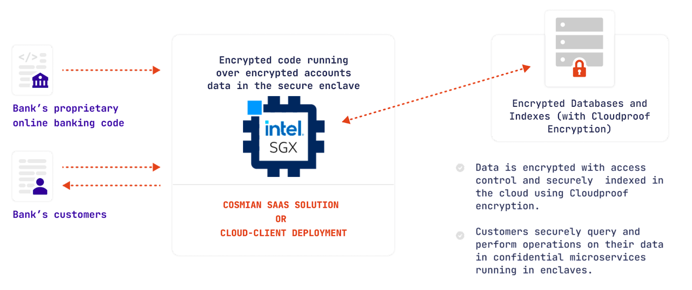
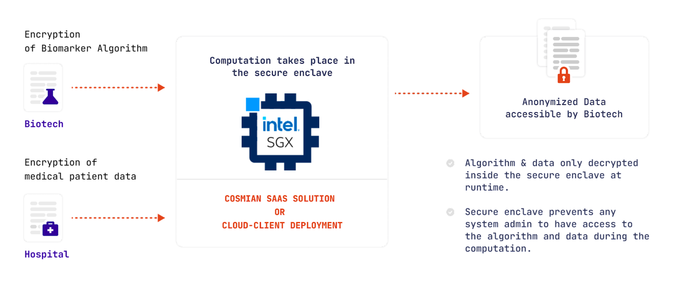

MSE covers the three following scenarii that you can select using the configuration file when deploying your application

## Zero trust approach: collaborative computation

In that scenario, no one trusts the other participants.

|                      | Cloud provider | Cosmian | App owner | A third party |
| :------------------: | :------------: | :-----: | :-------: | :-----------: |
| The app owner trusts |       ❌        |    ❌    |    NA     |       ❌       |
| The app user trusts  |       ❌        |    ❌    |     ❌     |       ❌       |

A real world example could be a data desensibilization in Healthcare: extraction of medical bio markers from patient data while keeping the patient data private: 

The Biotech company (*app owner*) doesn't want to make its code public from anyone.

The hospital (*app user*) doesn't want to share its data or any computation results with any one but itself.

It's the **default mode** of the `deploy` subcommand.

## App owner trust approach: fully encrypted SaaS

In that scenario, the app user trusts the app owner.

|                      | Cloud provider | Cosmian | App owner | A third party |
| :------------------: | :------------: | :-----: | :-------: | :-----------: |
| The app owner trusts |       ❌        |    ❌    |    NA     |       ❌       |
| The app user trusts  |       ❌        |    ❌    |     ✅     |       ❌       |

A real world example could be a bank wishing to move to cloud and securely operating the online 
banking application in the cloud: 

TODO: remove cloudproof encryption

The bank (*app owner*) doesn't want to make its code public especially from Cosmian or the cloud provider. 

The bank's customer (*app user*) already trusts the bank through the banking application or website. They already shares their data or computation results with no one but the bank.

Therefore, the app owner has to deploy its application by giving a ssl certificate using the `ssl` paragraph in the config file.

## Any trust approach: quick start dev

In that scenario, the app user trusts Cosmian and the app owner.

|                      | Cloud provider | Cosmian | App owner | A third party |
| :------------------: | :------------: | :-----: | :-------: | :-----------: |
| The app owner trusts |       ❌        |    ❌    |    NA     |       ❌       |
| The app user trusts  |       ❌        |    ✅    |     ✅     |       ❌       |

This scenario is pretty interesting for developers wishing to test their application without being concerned by any SSL generation or DNS configuration.

Therefore, the app owner has to deploy their application by setting `dev=true` in the config file.

## In practice

To cover these scenarii, mse has been implemented with these following features:

|                       Features                       | Zero trust approach | Fully encrypted SaaS | Quick start dev |
| :--------------------------------------------------: | :-----------------: | :------------------: | :-------------: |
|   Code encryption when dispatching to the mse node   |          ✅          |          ✅           |        ✅        |
| Code & Data encryption when running (on disk/on ram) |          ✅          |          ✅           |        ✅        |
| App owner can verify the mse instance when deploying |          ✅          |          ✅           |        ✅        |
|       User can verify the mse instance on use        |          ✅          |          ❌           |        ❌        |
|            User queries & data encryption            |          ✅          |     👁️ App Owner      |    👁️ Cosmian    |
|           App is working on a web browser            |          ❌          |          ✅           |        ✅        |

### Code encryption when running

An mse node is an intel sgx enclave which enables Cosmian to run the app in a complete isolated environment in which the filesystem and the memory are completly encrypted from anyone. 