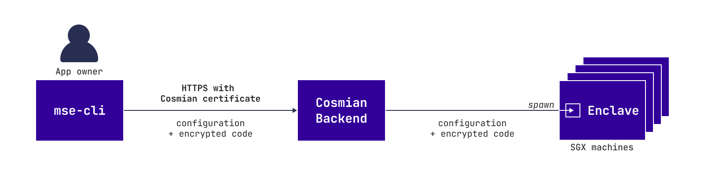
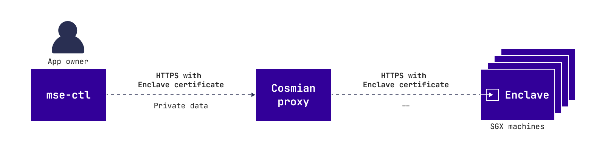
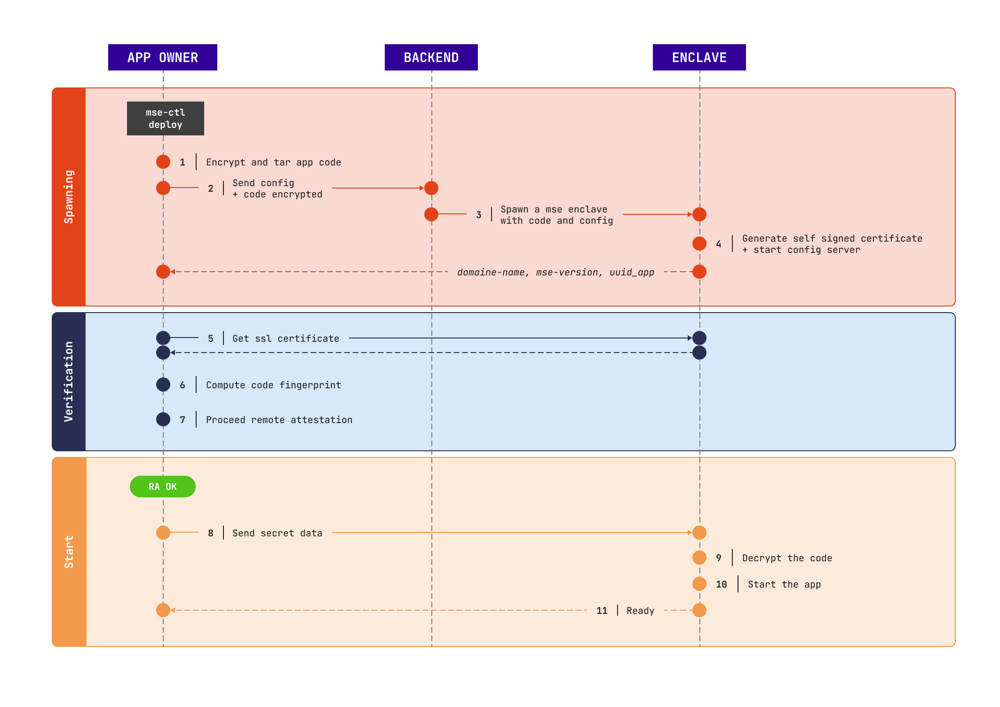

## Overview

The deployment step consists for the app owner in deploying their application into Cosmian Enclave. Basically:

- Send the code and the configuration
- Allocate the resource and spawn the app
- Check the trustworthiness of their service

The deployment is breaking down into two stages: 

- The first one consists in interacting with the Cosmian Enclave SaaS backend by sending the code and the configuration

  

- The second one consists in interacting right with the spawned Cosmian Enclave SaaS node

  

When you use `mse cloud deploy` these two stages are merged into this single subcommand.

## Deployment process

Let's describe in a deeper way what happens when the *app owner* uses: `mse cloud deploy`.

### Stage 1: code encryption when dispatching

In stage 1, because the TLS connection between the app owner and Cosmian are managed by Cosmian and because the app owner wants to protect their code from Cosmian, the code is sent encrypted to Cosmian with a key only known by the app owner. 

The cryptography specifications are explained [here](security.md).

All the [ scenarios](./scenarios.md) proceed that way. 

### Cosmian Enclave instance verification

Between stage 1 and stage 2, the app owner should verify the app, that is to say:

- check that the code is **running inside an enclave**
- check that this **enclave belongs to Cosmian**
- check that the **code is exactly theirs**

If not, the app owner shouldn't proceed with stage 2 (`mse cloud deploy` won't proceed). The stage 2 consists in sending the secret data which can be done only if we are sure the TLS connection is trusted.

This stage is skipped when deploying using `--no-verify`.

For more details about this step, read [security](security.md).

### Stage 2: secret data configuration

At this point, the app owner has sent their encrypted code inside the Cosmian Enclave SaaS node and trusts it. 
Before the application being able to start, the Cosmian Enclave SaaS node needs several extra secret parameters:

- The key to decrypt the code
- The private key of the SSL certificate if the TLS connection of the app is managed by the app owner ([ scenario #2](./scenarios.md#app-owner-trust-approach-fully-encrypted-saas))

Both these parameters are sent straight to the Cosmian Enclave SaaS node using the dedicated TLS connection managed 
by the enclave. Therefore, only the Cosmian Enclave app can decrypt the app code previously sent.

## Start the application

The app owner code is decrypted and started. 

The TLS connection used is described in the [ next paragraph](./how_it_works_use.md)

